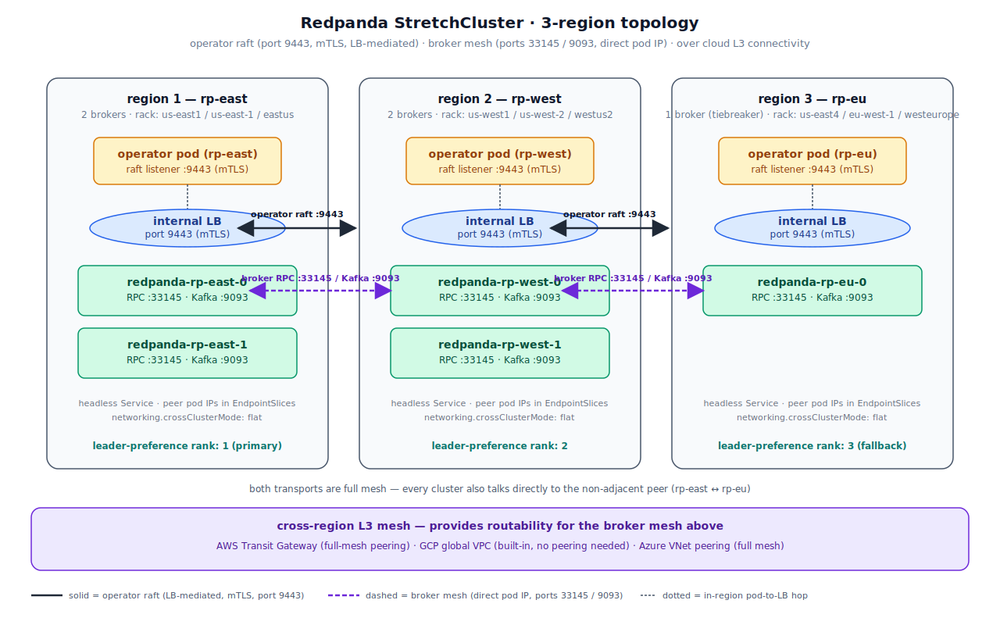

# Redpanda Operator v26.2.1-beta.1 — Stretch Cluster on AWS, GCP, or Azure

A working, end-to-end deployment of a 3-region Redpanda **StretchCluster** managed by `operator/v26.2.1-beta.1`. Most recently validated on AWS, GCP, and Azure — see the [validation matrix](#validation-matrix) just before [Prerequisites](#prerequisites) for the region triples used and per-cloud demo outcomes.

This repo captures the exact configs that brought a stretch cluster up green on first boot, plus the gotchas that aren't in the reference doc. The `aws/`, `gcp/`, and `azure/` directories each bundle the terraform, manifests, and helm-values that actually work for that cloud — see [Troubleshooting](#troubleshooting) for the why behind each one.

## Table of contents

- [Repo layout](#repo-layout)
- [Architecture](#architecture)
- [Validation matrix](#validation-matrix)
- [Prerequisites](#prerequisites)
- [Step-by-step](#step-by-step)
  - [1. Provision infrastructure (Terraform)](#1-provision-infrastructure-terraform)
  - [2. Install the rpk-k8s plugin](#2-install-the-rpk-k8s-plugin)
  - [3. Bootstrap multicluster TLS + kubeconfig secrets](#3-bootstrap-multicluster-tls--kubeconfig-secrets)
  - [4. License Secret + helm install](#4-license-secret--helm-install)
  - [5. Install cert-manager per cluster](#5-install-cert-manager-per-cluster)
  - [6. Apply StretchCluster + NodePools](#6-apply-stretchcluster--nodepools)
  - [7. Wait for StretchCluster status conditions to go green](#7-wait-for-stretchcluster-status-conditions-to-go-green)
  - [8. Validate stretch cluster health using rpk k8s multicluster](#8-validate-stretch-cluster-health-using-rpk-k8s-multicluster)
  - [9. Quick test — produce and consume across clusters](#9-quick-test--produce-and-consume-across-clusters)
- [Optional demos](#optional-demos)
  - [Demo A: leader pinning + region-failure fallthrough](#demo-a-leader-pinning--region-failure-fallthrough)
  - [Demo B: regional failure + temporary failover-region capacity injection](#demo-b-regional-failure--temporary-failover-region-capacity-injection)
- [Tear down](#tear-down)
- [Troubleshooting](#troubleshooting)
- [Cost (running)](#cost-running)

## Repo layout

```
aws/
  terraform/    — VPCs, EKS, Transit Gateway peering, AWS LB Controller, peer LB Services
  manifests/    — stretchcluster.yaml + nodepool-*.yaml (rack preference baked for AWS regions)
  helm-values/  — values-*.example.yaml; fill in <PLACEHOLDER>s before use
gcp/
  terraform/    — Single global VPC + 3 regional subnets, GKE, firewall rules, peer LB Services
  manifests/    — stretchcluster.yaml + nodepool-*.yaml (rack preference baked for GCP regions)
  helm-values/  — values-*.example.yaml; fill in <PLACEHOLDER>s before use
azure/
  terraform/    — VNets, AKS, full-mesh VNet peering, NSGs, peer LB Services
  manifests/    — stretchcluster.yaml + nodepool-*.yaml (rack preference baked for Azure regions)
  helm-values/  — values-*.example.yaml; fill in <PLACEHOLDER>s before use
omb/             — cloud-agnostic 10 Mbps continuous-load Jobs that run alongside Demo A / B
                  (kafka-producer-perf-test + kafka-consumer-perf-test in the redpanda namespace,
                  plus run-demo.sh that wraps the cordon/uncordon dance with snapshots of broker
                  health + producer throughput) — see omb/README.md
```

Each top-level cloud directory is self-contained — pick one cloud and run the full flow (terraform → bootstrap → helm install → manifests) from inside it. The nodepool manifests are cloud-agnostic; the only cloud-specific manifest difference is the `default_leaders_preference` rack list in `stretchcluster.yaml`, which uses the GKE/EKS/AKS-specific `topology.kubernetes.io/region` label values for that cloud.

## Architecture

<p align="center">
  
</p>

> **Reading the diagram.** Solid arrows are the **operator-to-operator raft** path (port 9443, mTLS, terminated at each region's internal LoadBalancer). Dashed arrows are **direct broker-to-broker** traffic — RPC :33145 and Kafka :9093 — which uses pod IPs (no LB hop) routed over the cloud's L3 mesh shown in the band below the regions. Both transports are full mesh among all three clusters.

Two transports:
- **Operator-to-operator (raft, port 9443)** — internal cloud LB per cluster, addresses baked into TLS SANs by `rpk k8s multicluster bootstrap --loadbalancer`.
- **Broker-to-broker (RPC 33145, Kafka 9093)** — direct pod-IP routing. `networking.crossClusterMode: flat` makes the operator render headless Services and EndpointSlices populated with peer pod IPs. Routability comes from the cloud's L3 connectivity.

### Broker layout: 2 / 2 / 1 with RF=5

Each NodePool sets a per-region broker count: `nodepool-rp-east.yaml` and `nodepool-rp-west.yaml` use `replicas: 2`, `nodepool-rp-eu.yaml` uses `replicas: 1` — five brokers total, deployed `2 / 2 / 1` across the three regions. The default replication factor for new topics is `5` (one replica per broker), and the controller raft also includes all five brokers, so both data and control-plane raft groups need a 3-of-5 majority to make progress.

The asymmetric `2 / 2 / 1` shape — instead of `2 / 2 / 2` or `1 / 1 / 1` — is the cheapest layout that survives **any single full-region outage** without losing quorum:

| Region lost | Brokers remaining | Quorum (need 3) |
|---|---|---|
| rp-east (2 gone) | `0 + 2 + 1` = **3** | ✓ exactly at threshold |
| rp-west (2 gone) | `2 + 0 + 1` = **3** | ✓ exactly at threshold |
| rp-eu (1 gone)   | `2 + 2 + 0` = **4** | ✓ comfortable margin |

The 1-broker `rp-eu` region acts as the **odd-vote tiebreaker** between the two larger regions. Losing it is cheap (you still have four brokers in two regions); losing either two-broker region drops to exactly the quorum minimum, so it's tolerated but tight — replication should already be caught up before a second failure can stack on top. A `1 / 1 / 1` cluster (RF=3) survives a single-region loss too, but with no spare capacity for a concurrent broker failure within a surviving region; `2 / 2 / 1` keeps a one-broker buffer in each large region.

`default_leaders_preference: "ordered_racks:<r1>,<r2>,…"` on top of this layout pins leadership to the first listed rack while it is healthy, then fails over to `<r2>`, `<r3>`, … as higher-priority racks become unavailable. (See [Redpanda's leader-pinning docs](https://docs.redpanda.com/current/develop/produce-data/leader-pinning/#failover-with-ordered-rack-preference) — the older `racks:<r1>,<r2>,…` format is a *constrained set* with no priority order, intentionally distinct.) The shipped manifests list the primary region first, then the failover region (used by `<cloud>/terraform-failover/`), then the remaining regions, so steady-state read/write traffic stays in the primary region (lowest latency) and a regional outage relocates leadership to the closest healthy rack — see [Demo A](#demo-a-leader-pinning--region-failure-fallthrough).

## Validation matrix

Most recently validated on **all three clouds** with [`ordered_racks` leader pinning](https://docs.redpanda.com/current/develop/produce-data/leader-pinning/#failover-with-ordered-rack-preference) and a continuous **10 Mbps OMB-style producer + consumer** running through Demo A (leader pinning) and Demo B (failover capacity injection):

| Cloud | Region triple (+ failover) | Demo A | Demo B | Producer survived? | AWS-style cross-region heartbeat issue? |
|---|---|---|---|---|---|
| **GCP / GKE** | `us-east1` / `us-west1` / `us-east4` (+ `us-central1`) | ✓ leaders 6/6 → fall through → return | ✓ stalled → unstuck after capacity → 5 brokers healthy | ✓ 1280 msg/s steady (24 ms baseline → 100-220 ms during failure → 38 ms post) | No (all RTTs < 100 ms) |
| **Azure / AKS** | `eastus` / `westus2` / `centralus` (+ `eastus2`) | ✓ leaders 6/6 → fall through → return | ✓ stalled → unstuck after capacity → 5 brokers healthy | ✓ 1280 msg/s steady (50 ms baseline → 150 ms during failure → 47 ms post) | No (all RTTs < 100 ms) |
| **AWS / EKS** | `us-east-1` / `us-west-2` / `eu-west-1` (+ `us-east-2`) | ✓ leaders 6/6 → fall through → return | ✓ stalled → unstuck after capacity + manual controller-leadership transfer to `us-east-2` → 5 brokers healthy | ✓ 1280 msg/s steady (84 ms baseline → 270 ms during failure → 87 ms post) | **Yes** — `eu-west-1 ↔ us-west-2` is ~140 ms; transfer the controller raft leader to a us-east-2 broker after step 4 of Demo B. See the [AWS-only callout](#demo-b-regional-failure--temporary-failover-region-capacity-injection). |

The continuous-load harness lives at [`omb/`](omb/) and runs as a pair of K8s Jobs in the `redpanda` namespace (single-pod kafka-producer-perf-test + kafka-consumer-perf-test, mTLS to the operator-issued CA). It produces ~1.25 MB/s = 10 Mbps for as long as the demo runs and prints throughput / latency every 5 s, so a regional outage shows up immediately as latency climbing — not as silent data loss.

## Prerequisites

| Tool | Min version |
|---|---|
| Cloud CLI for your provider — `aws` / `gcloud` / `az` | latest stable |
| `terraform` | ≥ 1.6 |
| `kubectl` | matches your K8s version (1.31 here) |
| `helm` | ≥ 3.14 |
| `rpk` | base CLI; the v26.2.1-beta.1 `rpk-k8s` plugin is installed in step 2 |
| GCP only: `gke-gcloud-auth-plugin` | latest |

Plus a **Redpanda Enterprise license** — required, not optional. The multicluster operator binary won't start without one (see [Troubleshooting](#troubleshooting) issue 1).

## Step-by-step

The flow: Terraform provisions infrastructure (step 1) → install the rpk-k8s plugin (step 2) → manual steps (3+) bootstrap multicluster, install the operator and StretchCluster. Steps 2 onward are cloud-agnostic — once the kubectl contexts `rp-east`, `rp-west`, `rp-eu` are registered, the same commands work on AWS, GCP, or Azure.

### 1. Provision infrastructure (Terraform)

Pick your cloud and follow the corresponding Terraform README — each handles VPCs/VNets, K8s clusters, cross-region networking, and pre-creates the peer LB Services for step 3:

| Cloud | Terraform | Networking model |
|---|---|---|
| **AWS / EKS** | [`aws/terraform/`](aws/terraform/README.md) | Transit Gateway with full-mesh inter-region peering |
| **GCP / GKE** | [`gcp/terraform/`](gcp/terraform/README.md) | Single global VPC with 3 regional subnets (no peering needed — GCP VPCs are global) |
| **Azure / AKS** | [`azure/terraform/`](azure/terraform/README.md) | 3 regional VNets with full-mesh VNet peering |

```bash
cd <aws|gcp|azure>/terraform
terraform init
terraform apply         # AWS / Azure
# or:
terraform apply -var project_id=<your-gcp-project>     # GCP
```

First apply takes ~15–25 minutes (control planes are the long pole; everything else is parallel).

> **Azure side-note: 6 resource groups will appear, not 3.** Terraform creates one user RG per cluster (`rp-east-rg`, `rp-west-rg`, `rp-eu-rg`) holding the VNet, subnet, NSG, AKS control-plane resource pointer, and peer LB Service. AKS *also* auto-creates a sibling **node resource group** per cluster, named `MC_<parent-rg>_<cluster>_<region>` (so e.g. `MC_rp-east-rg_rp-east_eastus`), to hold the actual node VMSS, NICs, public IPs, internal LBs, and route table. You don't manage the `MC_*` RGs directly — AKS owns them, and they're torn down automatically when terraform deletes the AKS cluster resource. Don't be surprised by the 6 RGs in the portal; both sets are expected, and `az group list --query "[?contains(name, 'rp-')]"` will show them all.

Register the three clusters as kubectl contexts named `rp-east`, `rp-west`, `rp-eu`:

```bash
terraform output -raw kubectl_setup_commands | bash

# verify
for C in rp-east rp-west rp-eu; do
  kubectl --context "$C" get nodes
done
```

Capture the values needed by the next steps:

```bash
terraform output peer_lb_addresses    # GCP/Azure (IPs) — or peer_lb_hostnames on AWS (NLB DNS names)
terraform output -raw kubectl_setup_commands   # for reference
```

### 2. Install the `rpk-k8s` plugin

The multicluster bootstrap, status, and config are driven by `rpk k8s multicluster`, which lives in a versioned plugin shipped alongside each operator release. Install the plugin matching the operator version (`v26.2.1-beta.1`):

```bash
ARCH=darwin-arm64   # or linux-amd64, etc.
curl -sSLO "https://github.com/redpanda-data/redpanda-operator/releases/download/operator/v26.2.1-beta.1/rpk-k8s-${ARCH}-v26.2.1-beta.1.tar.gz"
tar -xzf "rpk-k8s-${ARCH}-v26.2.1-beta.1.tar.gz"
mkdir -p "$HOME/.local/bin"
install "rpk-k8s-${ARCH}" "$HOME/.local/bin/.rpk.ac-k8s"
export PATH="$HOME/.local/bin:$PATH"
rpk k8s multicluster --help
```

### 3. Bootstrap multicluster TLS + kubeconfig secrets

```bash
rpk k8s multicluster bootstrap \
  --context rp-east --context rp-west --context rp-eu \
  --namespace redpanda \
  --loadbalancer \
  --loadbalancer-timeout 10m
```

Bootstrap reuses the peer LB Services that Terraform pre-created (its `CreateOrUpdate` preserves the cloud-specific annotations). It emits a ready-to-paste `multicluster.peers` block.

Render per-cluster helm values from the example templates and substitute the peer addresses + cluster API endpoints:

```bash
for C in rp-east rp-west rp-eu; do
  cp <cloud>/helm-values/values-${C}.example.yaml /tmp/values-${C}.yaml
done

# Substitute the API server endpoint per cluster.
# AWS:    aws eks describe-cluster --region <r> --name <c> --query cluster.endpoint --output text
# GCP:    https://$(gcloud container clusters describe <c> --region <r> --format='value(endpoint)')
# Azure:  az aks show -n <c> -g <c>-rg --query fqdn -o tsv  (prefix with https://)

# And the peer LB hostnames/IPs (whichever your cloud emitted) into the three peers entries.
# AWS uses hostnames, GCP and Azure use IPs.
```

The example values use `<RP_EAST_API_SERVER>`, `<RP_EAST_NLB_HOSTNAME>`, etc. as placeholders — replace them with what `terraform output` emitted.

### 4. License Secret + helm install

The license itself is **never committed**. Place your license at a local path and create the Secret per cluster:

```bash
export RP_LICENSE=/path/to/redpanda.license   # not in this repo

for C in rp-east rp-west rp-eu; do
  kubectl --context "$C" -n redpanda create secret generic redpanda-license \
    --from-file=license.key="$RP_LICENSE" \
    --dry-run=client -o yaml | kubectl --context "$C" apply -f -
done

helm repo add redpanda https://charts.redpanda.com --force-update && helm repo update

for C in rp-east rp-west rp-eu; do
  helm --kube-context "$C" upgrade --install \
    "$C" redpanda/operator \
    --namespace redpanda \
    --version 26.2.1-beta.1 --devel \
    -f /tmp/values-${C}.yaml \
    --wait --timeout 5m &
done
wait
```

Note the **helm release name == cluster context name**. This makes the chart's `operator.Fullname` equal the context name, which keeps the bootstrap-created TLS Secret name (`<ctx>-multicluster-certificates`) aligned with what the chart looks up. Avoids the trap of needing `--name-override` (which collides peer names — see [Troubleshooting](#troubleshooting) issue 3).

Confirm:

```bash
rpk k8s multicluster status --context rp-east --context rp-west --context rp-eu --namespace redpanda
```

You should see `OPERATOR=Running`, one cluster as `StateLeader`, all `PEERS=3`, `UNHEALTHY=0`, and the four cross-cluster checks ✓.

### 5. Install cert-manager per cluster

Required because `tls.enabled: true` on the StretchCluster spec triggers the operator to create cert-manager `Certificate` and `Issuer` resources — without it, broker pods stay stuck in `Init` waiting for the leaf-cert Secrets to appear (see [Troubleshooting](#troubleshooting) issue 5). cert-manager is independent of steps 1–4 and can be installed any time before step 6 (in parallel if you want to save wall-clock time).

```bash
helm repo add jetstack https://charts.jetstack.io --force-update && helm repo update

for C in rp-east rp-west rp-eu; do
  helm --kube-context "$C" upgrade --install cert-manager jetstack/cert-manager \
    --namespace cert-manager --create-namespace \
    --version v1.17.2 \
    --set crds.enabled=true \
    --wait --timeout 5m &
done
wait
```

### 6. Apply StretchCluster + NodePools

(Terraform already annotates the default StorageClass on AWS — `gp2`. GKE and AKS ship a default already; no patch needed.)

The repo ships one `stretchcluster.yaml` and three `nodepool-rp-{east,west,eu}.yaml` per cloud. The StretchCluster CR is identical across the three K8s clusters (it's the cluster-wide Redpanda spec); each NodePool defines that cluster's slice of the broker fleet — `replicas: 2` for rp-east and rp-west, `replicas: 1` for rp-eu (the 2 / 2 / 1 quorum-tiebreaker shape — see [Broker layout](#broker-layout-2--2--1-with-rf5)).

**`<cloud>/manifests/stretchcluster.yaml`** (GCP example shown — AWS/Azure differ only in the `default_leaders_preference` rack list):

```yaml
apiVersion: cluster.redpanda.com/v1alpha2
kind: StretchCluster
metadata:
  name: redpanda
  namespace: redpanda
spec:
  rbac:
    enabled: true
  external:
    enabled: false
  networking:
    crossClusterMode: flat              # operator manages headless Services + EndpointSlices
  rackAwareness:
    enabled: true
    nodeAnnotation: topology.kubernetes.io/region   # rack = cloud region
  tls:
    enabled: true
    certs:
      default:
        caEnabled: true
  enterprise:
    licenseSecretRef:
      name: redpanda-license
      key: license.key
  config:
    cluster:
      # Ordered leader pinning — primary region first, failover region (used by
      # <cloud>/terraform-failover/) second, remaining regions after. Cloud-specific:
      #   AWS:   ordered_racks:us-east-1,us-east-2,us-west-2,eu-west-1
      #   GCP:   ordered_racks:us-east1,us-central1,us-west1,us-east4
      #   Azure: ordered_racks:eastus,eastus2,westus2,centralus
      default_leaders_preference: "ordered_racks:us-east1,us-central1,us-west1,us-east4"
      partition_autobalancing_node_availability_timeout_sec: 600   # 10 min — long enough for Demo A
      partition_autobalancing_node_autodecommission_timeout_sec: 900   # 15 min — Demo B observation window
```

**`<cloud>/manifests/nodepool-rp-east.yaml`** (rp-west uses an identical shape with `name: rp-west`; rp-eu uses `replicas: 1`):

```yaml
apiVersion: cluster.redpanda.com/v1alpha2
kind: NodePool
metadata:
  name: rp-east
  namespace: redpanda
spec:
  clusterRef:
    group: cluster.redpanda.com
    kind: StretchCluster
    name: redpanda
  replicas: 2                           # rp-eu uses replicas: 1 (the tiebreaker)
  image:
    repository: redpandadata/redpanda
    tag: v26.1.6
  services:
    perPod:
      remote:
        enabled: true                   # required so per-pool Services for remote pools render
```

Apply the StretchCluster (identical on every cluster):

```bash
for C in rp-east rp-west rp-eu; do
  kubectl --context "$C" -n redpanda apply -f <cloud>/manifests/stretchcluster.yaml
done
```

Apply each NodePool to its own cluster:

```bash
kubectl --context rp-east -n redpanda apply -f <cloud>/manifests/nodepool-rp-east.yaml
kubectl --context rp-west -n redpanda apply -f <cloud>/manifests/nodepool-rp-west.yaml
kubectl --context rp-eu   -n redpanda apply -f <cloud>/manifests/nodepool-rp-eu.yaml
```

The StretchCluster spec uses **`networking.crossClusterMode: flat`** (operator manages headless Services + EndpointSlices with peer pod IPs — appropriate when the cloud gives you direct pod-to-pod routability across regions, which all three providers do here), and each NodePool has **`services.perPod.remote.enabled: true`** (so per-pool Services get rendered for remote pools too — required so peer DNS lookups resolve). See [Troubleshooting](#troubleshooting) issues 6–7 for the why behind each.

### 7. Wait for StretchCluster status conditions to go green

```bash
kubectl --context rp-east -n redpanda get stretchcluster redpanda \
  -o jsonpath='{range .status.conditions[*]}{.type}={.status}{"\n"}{end}'
```

Want to see all of: `Ready=True`, `Healthy=True`, `LicenseValid=True`, `ResourcesSynced=True`, `ConfigurationApplied=True`, `SpecSynced=True`. (`Stable` and `Quiesced` may report `False` for a few minutes after a config change — that's normal.)

### 8. Validate stretch cluster health using `rpk k8s multicluster`

Two checks confirm the cluster is fully wired up — one for the operator/raft layer and one for the Redpanda data plane.

**Operator + cross-cluster raft.** `rpk k8s multicluster status` connects to every operator pod (one per K8s cluster) over the bootstrap-managed mTLS, prints the raft role each one currently holds, and runs four cross-cluster sanity checks: that no two operators picked the same node name, that all operators agree on which peers exist, that they all agree on who the raft leader is at the same term, and that they all carry the same shared CA. A healthy install reports `OPERATOR=Running` everywhere, exactly one `StateLeader` and the rest `StateFollower`, `PEERS=3`, `UNHEALTHY=0`, `TLS=ok`, `SECRETS=ok`, and ✓ on all four cross-cluster checks:

```
$ rpk k8s multicluster status --context rp-east --context rp-west --context rp-eu --namespace redpanda
CLUSTER  OPERATOR  RAFT-STATE     LEADER  PEERS  UNHEALTHY  TLS  SECRETS
rp-east  Running   StateFollower  rp-eu   3      0          ok   ok
rp-west  Running   StateFollower  rp-eu   3      0          ok   ok
rp-eu    Running   StateLeader    rp-eu   3      0          ok   ok

CROSS-CLUSTER:
  ✓ [unique-names] all node names are unique
  ✓ [peer-agreement] peer lists agree across all clusters
  ✓ [leader-agreement] leader agreement: rp-eu (term 2)
  ✓ [ca-consistency] all clusters share the same CA
```

**Broker membership.** Once raft is healthy, the brokers themselves should have formed a single Redpanda cluster spanning the three K8s clusters. `rpk redpanda admin brokers list` (run inside any broker pod via `kubectl exec`) hits the local broker's Admin API and dumps the cluster's authoritative broker list. The point of running it from one region and seeing brokers in *all* regions is to confirm broker-to-broker discovery worked: the in-pod DNS resolved peer pod names like `redpanda-rp-west-0.redpanda` to actual cross-cluster pod IPs (via the operator's flat-mode EndpointSlices), traffic on port 33145 flowed through the cloud's L3 path (TGW / VPC / VNet peering), and the brokers gossiped successfully. Every row should show `MEMBERSHIP=active` and `IS-ALIVE=true`:

```
$ kubectl --context rp-east -n redpanda exec sts/redpanda-rp-east -c redpanda -- rpk redpanda admin brokers list
ID    HOST                         PORT   RACK       CORES  MEMBERSHIP  IS-ALIVE  VERSION  UUID
0     redpanda-rp-east-0.redpanda  33145  us-east-1  1      active      true      26.1.6   52351fe6-…
1     redpanda-rp-east-1.redpanda  33145  us-east-1  1      active      true      26.1.6   78f90065-…
2     redpanda-rp-eu-0.redpanda    33145  eu-west-1  1      active      true      26.1.6   72ecf5ff-…
3     redpanda-rp-west-0.redpanda  33145  us-west-2  1      active      true      26.1.6   3bda1c04-…
4     redpanda-rp-west-1.redpanda  33145  us-west-2  1      active      true      26.1.6   bad54b3e-…
```

All 5 brokers from the 2 / 2 / 1 layout should appear with their rack labels populated (each broker's K8s node `topology.kubernetes.io/region` flows into the rack column).

If `rpk multicluster status` looks healthy but `brokers list` doesn't show all the expected brokers, suspect a broker-network problem (firewall/SG missing port 33145, or `crossClusterMode` not set to `flat`); see [Troubleshooting](#troubleshooting) issues 6 and 9.

### 9. Quick test — produce and consume across clusters

Verify Kafka actually works end-to-end across the three clusters:

```bash
# Create a topic with RF=3 — Redpanda picks 3 of the 5 brokers per partition
kubectl --context rp-east -n redpanda exec sts/redpanda-rp-east -c redpanda -- \
  rpk topic create stretch-test --partitions 6 --replicas 3

# Confirm partitions are spread across all 5 brokers
kubectl --context rp-east -n redpanda exec sts/redpanda-rp-east -c redpanda -- \
  rpk topic describe stretch-test -p
# Each row's REPLICAS is a 3-broker subset of {0..4}; subsets vary per partition
# (e.g. [0 2 4], [1 2 3], [0 2 3]). Across all 6 partitions every broker should
# appear at least once.

# Produce keyed messages from rp-eu (Kafka controller cluster)
kubectl --context rp-eu -n redpanda exec sts/redpanda-rp-eu -c redpanda -- \
  bash -c 'for i in $(seq 1 9); do printf "k%d\thello-%d\n" $i $i; done | rpk topic produce stretch-test --format "%k\t%v\n"'

# Consume from a different cluster (rp-east)
kubectl --context rp-east -n redpanda exec sts/redpanda-rp-east -c redpanda -- \
  rpk topic consume stretch-test -n 9 -o start --format "p=%p o=%o k=%k v=%v\n"

# Consumer-group offsets persist across the cluster (run from a third cluster)
kubectl --context rp-west -n redpanda exec sts/redpanda-rp-west -c redpanda -- \
  rpk topic consume stretch-test -g cross-cluster-test -o start \
  --format "p=%p o=%o k=%k v=%v\n" -n 9

kubectl --context rp-east -n redpanda exec sts/redpanda-rp-east -c redpanda -- \
  rpk group describe cross-cluster-test
# Expect TOTAL-LAG=0 and per-partition CURRENT-OFFSET == LOG-END-OFFSET.
```

If any of these fail with `i/o timeout` or `dial tcp ...: connect: connection refused`, jump to issue 9 below — it's almost always a missing firewall/SG rule.

> **Continuous load during the demos: see [`omb/`](omb/).** The smoke test above is a one-shot sanity check. For Demo A and Demo B (next section), run [`omb/producer-job.yaml`](omb/producer-job.yaml) + [`omb/consumer-job.yaml`](omb/consumer-job.yaml) so a real client is producing/consuming at 10 Mbps the entire time the demo is running — that's how you verify the cluster keeps serving Kafka traffic through a regional outage rather than just changing internal raft state.

## Optional demos

The default `stretchcluster.yaml` enables two stretch-cluster-specific features: **rack-aware leader pinning with ordered failover** (partition leaders sit in the primary region while it's healthy and migrate to a designated low-RTT fallback region during an outage) and **automatic broker decommissioning** (a permanently-gone broker gets evicted from the cluster). Both demos below run end-to-end with **no extra `rpk cluster config set` steps** — the relevant cluster config keys are committed into `<cloud>/manifests/stretchcluster.yaml` and applied at deploy time.

The committed defaults are:

| Key | Value (GCP example) | Why |
|---|---|---|
| `default_leaders_preference` | `ordered_racks:us-east1,us-central1,us-west1,us-east4` | Ordered leader pinning. The list goes primary → failover → remaining regions, so steady-state read/write traffic stays in the primary region and outages migrate leadership to the closest healthy rack. AWS / Azure use the cloud-equivalent region triples — see each cloud's `<cloud>/manifests/stretchcluster.yaml`. |
| `partition_autobalancing_node_availability_timeout_sec` | `600` | 10 min — long enough that Demo A's "scale region down → restore" cycle finishes before the autobalancer marks the brokers unavailable. |
| `partition_autobalancing_node_autodecommission_timeout_sec` | `900` | 15 min — must be > availability timeout. Demo B observes the autodecom kicking in once a broker stays unreachable past this threshold. |

**`ordered_racks:` vs `racks:` — they have different semantics.** Per [Redpanda's leader-pinning docs](https://docs.redpanda.com/current/develop/produce-data/leader-pinning/#failover-with-ordered-rack-preference), `ordered_racks:<r1>,<r2>,…` (Redpanda 26.1+) "places leaders in the first listed rack when available, failing over to each subsequent rack when higher-priority racks are unavailable." The older `racks:<r1>,<r2>,…` is a *constrained set* — leaders distribute equally across listed racks with no priority order. The shipped manifests use `ordered_racks:` so that during a primary-region outage the cluster relocates leadership to the failover region (listed second) instead of spreading it across all surviving regions.

**Why the timeouts are still demo-fast even at 10 / 15 min.** Production defaults are 900s / 600s; the autodecommission *is the demo* in Demo B, so we must keep autodecom_timeout finite. 15 min is long enough to ride out a transient rolling restart, short enough to finish Demo B in one sitting. **Raise both substantially in production** — a transient regional blip shouldn't trigger an automatic decommission.

Run both demos after step 9 (Quick test) on a healthy cluster.

### Demo A: leader pinning + region-failure fallthrough

The committed `<cloud>/manifests/stretchcluster.yaml` configures rack-aware leader pinning with an ordered failover list — primary region first, then the failover region used by `<cloud>/terraform-failover/`, then the remaining regions:

```yaml
rackAwareness:
  enabled: true
  nodeAnnotation: topology.kubernetes.io/region   # rack = cloud region

config:
  cluster:
    # Ordered preference. Leaders sit in the first reachable rack and fall
    # over to the next listed rack on outage (Redpanda 26.1+ ordered_racks).
    # Cloud-specific values:
    #   AWS:   ordered_racks:us-east-1,us-east-2,us-west-2,eu-west-1
    #   GCP:   ordered_racks:us-east1,us-central1,us-west1,us-east4
    #   Azure: ordered_racks:eastus,eastus2,westus2,centralus
    default_leaders_preference: "ordered_racks:us-east-1,us-east-2,us-west-2,eu-west-1"
```

Each broker reads its K8s node's `topology.kubernetes.io/region` label and uses it as its rack — so brokers end up tagged with the region they live in (one rack per region). The five steps below use AWS region names as a concrete example; substitute your cloud's names when you read the outputs.

> **Run continuous load (recommended).** Apply the [`omb/`](omb/) Jobs *before* starting Demo A so the producer + consumer are at steady state when you cordon the primary region. The throughput line jumps from `~84 ms avg` (AWS), `~50 ms` (Azure), `~24 ms` (GCP) baseline up to `~150-270 ms` during the failure window and back down on restore — that's the visible proof the cluster kept serving traffic. `omb/run-demo.sh demo-a` wraps the cordon-and-delete loop with cluster-health snapshots between each step.
>
> ```bash
> kubectl --context rp-east -n redpanda exec sts/redpanda-rp-east -c redpanda -- \
>   rpk topic create load-test --partitions 12 --replicas 5
> kubectl --context rp-east -n redpanda apply -f omb/producer-job.yaml -f omb/consumer-job.yaml
> # then proceed with the demo steps below — load is in the background
> ```

**Step 1 — verify rack labels are populated**

```bash
kubectl --context rp-east -n redpanda exec sts/redpanda-rp-east -c redpanda -- \
  rpk redpanda admin brokers list
```

Expected output — every broker has a `RACK` value matching its region (the `UUID` column was added in recent rpk versions; older outputs end at `VERSION`):

```
ID    HOST                         PORT   RACK       CORES  MEMBERSHIP  IS-ALIVE  VERSION  UUID
0     redpanda-rp-east-0.redpanda  33145  us-east-1  1      active      true      26.1.6   52351fe6-…
1     redpanda-rp-east-1.redpanda  33145  us-east-1  1      active      true      26.1.6   78f90065-…
2     redpanda-rp-eu-0.redpanda    33145  eu-west-1  1      active      true      26.1.6   72ecf5ff-…
3     redpanda-rp-west-0.redpanda  33145  us-west-2  1      active      true      26.1.6   3bda1c04-…
4     redpanda-rp-west-1.redpanda  33145  us-west-2  1      active      true      26.1.6   bad54b3e-…
```

**Step 2 — create the demo topic and watch leaders concentrate in the preferred rack**

Create a 12-partition topic with RF=5 (so every partition has a replica on every broker):

```bash
kubectl --context rp-east -n redpanda exec sts/redpanda-rp-east -c redpanda -- \
  rpk topic create leader-pinning-demo --partitions 12 --replicas 5
```

```
TOPIC                STATUS
leader-pinning-demo  OK
```

Wait ~60 s for the leader balancer to converge, then describe partitions:

```bash
sleep 60
kubectl --context rp-east -n redpanda exec sts/redpanda-rp-east -c redpanda -- \
  rpk topic describe leader-pinning-demo -p
```

Expected — every replica list contains all 5 brokers, and every leader is broker 0 or 1 (the two `us-east-1` brokers in the preferred rack):

```
PARTITION  LEADER  EPOCH  REPLICAS     LOG-START-OFFSET  HIGH-WATERMARK
0          0       2      [0 1 2 3 4]  0                 0
1          0       1      [0 1 2 3 4]  0                 0
2          0       2      [0 1 2 3 4]  0                 0
3          0       2      [0 1 2 3 4]  0                 0
4          1       2      [0 1 2 3 4]  0                 0
5          1       2      [0 1 2 3 4]  0                 0
6          1       2      [0 1 2 3 4]  0                 0
7          0       1      [0 1 2 3 4]  0                 0
8          0       2      [0 1 2 3 4]  0                 0
9          1       1      [0 1 2 3 4]  0                 0
10         1       2      [0 1 2 3 4]  0                 0
11         1       1      [0 1 2 3 4]  0                 0
```

A leader-by-broker tally makes the pattern obvious:

```bash
kubectl --context rp-east -n redpanda exec sts/redpanda-rp-east -c redpanda -- \
  rpk topic describe leader-pinning-demo -p | awk 'NR>1 {print $2}' | sort | uniq -c
```

```
   6 0
   6 1
```

— all 12 leaders on the two `us-east-1` brokers (the preferred rack), evenly split.

**Step 3 — simulate the preferred region failing**

`kubectl scale sts redpanda-rp-east --replicas=0` does **not** work for this — the operator on every peer cluster reconciles the rp-east `NodePool` cross-cluster (via the kubeconfig secrets bootstrapped in step 3) and brings the StatefulSet back up within ~60 s. Likewise, patching the `NodePool` to `replicas: 0` triggers a *graceful* decommission, which stalls under RF=5 (the autobalancer has nowhere to land replicas) — so the brokers also stay up, just in a `condemned` state.

To simulate a true regional outage (brokers unreachable, no graceful drain), cordon every node in the rp-east K8s cluster and delete the broker pods. The operator can keep `replicas: 2` on the StatefulSet, but with all nodes cordoned the new pods sit `Pending`:

```bash
for N in $(kubectl --context rp-east get nodes -o name); do
  kubectl --context rp-east cordon "$N"
done
kubectl --context rp-east -n redpanda delete pod redpanda-rp-east-0 redpanda-rp-east-1 --grace-period=10
```

**Step 4 — confirm leaders fall through to the surviving brokers**

Wait ~2 min for the brokers to be marked unreachable and for the leader balancer to relocate leaders. Run the tally from a *surviving* cluster (rp-east's API is gone):

```bash
sleep 120
kubectl --context rp-west -n redpanda exec sts/redpanda-rp-west -c redpanda -- \
  rpk topic describe leader-pinning-demo -p | awk 'NR>1 {print $2}' | sort | uniq -c
```

Expected — with `ordered_racks` and the failover region not yet brought up (rank 2 is empty), leadership falls through to the next reachable rack in the list. For the AWS preference `ordered_racks:us-east-1,us-east-2,us-west-2,eu-west-1`, that's brokers 3 + 4 (`us-west-2`):

```
   6 3
   6 4
```

If during the transition you see something like `4 2 / 4 3 / 4 4` (eu-west-1 + us-west-2 + us-west-2), that's the leader balancer mid-convergence — broker 2 (`eu-west-1`, rank 4) is briefly used as a holder while replicas catch up. Wait another 30-60 s; leadership consolidates on the highest-priority reachable rack once partitions are re-replicated.

> **Cross-Atlantic heartbeat caveat (AWS only).** With brokers 0 + 1 down, the controller raft re-elects, and there's a non-trivial chance it lands on broker 2 (`eu-west-1`). Once that happens, the controller's heartbeats to brokers 3 + 4 (`us-west-2`) take ~140 ms RTT, which exceeds Redpanda's hardcoded 100 ms `node_status_rpc` timeout — so the controller silently marks those brokers as `IS-ALIVE=false` even though they're healthy. `rpk cluster health` from rp-eu shows them under `Nodes down:`. The autobalancer reads from the controller, so its decisions go wonky too. If you see this during the demo, manually transfer controller leadership to a closer broker (e.g. `rpk cluster maintenance enable --broker 2` from rp-eu, or kill the rp-eu pod once); GCP's `us-east1`/`us-west1`/`us-east4` triple stays under 100 ms so this caveat does not apply there.

**Step 5 — restore the primary and watch leaders return**

Uncordon the rp-east nodes; the pending broker pods schedule immediately:

```bash
for N in $(kubectl --context rp-east get nodes -o name); do
  kubectl --context rp-east uncordon "$N"
done
```

Brokers rejoin (~60 s), partitions catch up, the leader balancer moves leaders back to `us-east-1`. After ~2 min:

```bash
kubectl --context rp-east -n redpanda exec sts/redpanda-rp-east -c redpanda -- \
  rpk topic describe leader-pinning-demo -p | awk 'NR>1 {print $2}' | sort | uniq -c
```

```
   6 0
   6 1
```

**Caveats observed during validation:**

- The leader balancer **stalls during under-replicated periods** — when half a region's brokers go away, it pauses while the cluster is recovering, then resumes once partitions are re-replicated. Expect 30–90 s of "leaders not yet redistributed" while replicas are being rebuilt elsewhere.
- Cross-region heartbeats can flap during transitions — `rpk redpanda admin brokers list` may briefly show un-affected brokers as `IS-ALIVE=false`. Confirm against `rpk cluster health` (`Nodes down:` field) which uses the controller's authoritative view, except when the controller itself sits across the > 100 ms RTT line described in the caveat above.

### Demo B: regional failure + temporary failover-region capacity injection

The 2 / 2 / 1 broker layout with `RF=5` survives a single-region outage in terms of *quorum* (3 of 5 brokers remain), but it cannot *self-heal* RF: with `RF=5` and only 3 reachable brokers, the partition autobalancer has nowhere to rebuild the missing two replicas, so:

- The two brokers from the lost region get marked unavailable after `partition_autobalancing_node_availability_timeout_sec` (10 min)
- Auto-decommission would normally start after `partition_autobalancing_node_autodecommission_timeout_sec` (15 min), but it stalls (`partition_balancer/status: "stalled"`) because there's no way to rehome the replicas
- Brokers from the lost region stay in `draining`/`active` indefinitely, and every `RF=5` topic shows under-replicated partitions

The operational fix is to **add capacity in a fourth, separate failover region**. As soon as the cluster has 5 reachable brokers again, re-replication unblocks, the autobalancer drains the two lost brokers, and the cluster returns to RF=5 across the new layout. This demo walks through the full sequence: simulate the regional failure, observe the stall, deploy the failover region, watch recovery, then restore the primary and decommission the failover.

> **AWS-specific gotchas validated end-to-end (April 2026).** Demo B as written runs cleanly on GCP (where us-east1 ↔ us-west1 ↔ us-east4 are all under 100 ms RTT), but on AWS the eu-west-1 ↔ us-west-2 leg (~140 ms) trips two product limits that you'll have to work around:
>
> 1. **Cross-Atlantic heartbeat timeouts corrupt the cluster view.** When the controller raft leader lands in eu-west-1 (broker 2), it can't heartbeat us-west-2 brokers within Redpanda's hardcoded 100 ms `node_status_rpc` timeout. From eu-west-1's view, brokers 3+4 appear `IS-ALIVE=false` even though they're healthy; from us-west-2's view, broker 2 appears `IS-ALIVE=false` for the same reason. `partition_balancer/status` then reports the wrong `unavailable_nodes` set (you'll see `[2]` instead of `[0, 1]`), and the autobalancer makes decisions based on the wrong data. The workaround we converged on in validation: after step 4 brings up rp-failover (us-east-2), transfer controller leadership to a **rp-failover** broker — us-east-2 sits geographically central to all three surviving regions (us-east-1 down, us-west-2 ~70 ms, eu-west-1 ~80 ms — all under the 100 ms threshold), which us-west-2 doesn't (us-west-2 ↔ eu-west-1 is still ~140 ms). See the AWS-only callout under step 4.
>
> 2. **The rp-failover operator's startup requires all peers reachable.** The multicluster operator pod fetches kubeconfigs from every peer at startup (over the bootstrap-distributed mTLS LBs); if any peer's NLB is unreachable, startup blocks indefinitely on `name resolver error: produced zero addresses`. With rp-east cordoned, AWS LBC may also have reaped its NLB by the time you bring up rp-failover, so the DNS doesn't resolve at all from the failover region. Working around this requires temporarily un-cordoning rp-east just long enough for rp-failover's operator to fetch peer kubeconfigs, then re-cordoning to continue the demo. GCP doesn't hit this in our validation because none of the regions sit cross-Atlantic.
>
> If you're demoing on AWS, expect to do these workarounds by hand. GCP is the cleaner end-to-end story.

**Step 1 — simulate the regional failure**

Use the same cordon-and-delete approach as Demo A (a plain `kubectl scale sts ... --replicas=0` gets reverted by the cross-cluster operator reconciler):

```bash
for N in $(kubectl --context rp-east get nodes -o name); do
  kubectl --context rp-east cordon "$N"
done
kubectl --context rp-east -n redpanda delete pod redpanda-rp-east-0 redpanda-rp-east-1 --grace-period=10
```

> **AWS-only: cluster-view corruption while only rp-east is down (steps 1–3).** With brokers 0+1 down, controller raft re-elects somewhere — and there's a non-trivial chance it lands on broker 2 (`eu-west-1`). The ~140 ms RTT to `us-west-2` exceeds Redpanda's hardcoded 100 ms `node_status_rpc` timeout, so the controller silently marks brokers 3+4 (`us-west-2`) as `IS-ALIVE=false` and `partition_balancer/status` reports the wrong `unavailable_nodes` set (you'll see `[2]` or similar instead of `[0, 1]`). Check `curl https://localhost:9644/v1/partitions/redpanda/controller/0` from any reachable broker; if `leader_id` is `2`, transfer it. **In our validation, transferring to us-west-2 didn't fix things** — once the controller is in us-west-2 it can't heartbeat eu-west-1, so the same corruption shows up inverted (`unavailable_nodes: [2]`). The clean fix only emerges after step 4 brings up rp-failover in us-east-2; transferring the controller there restores a coherent cluster view because us-east-2 sits within 100 ms of every surviving region. Until then, expect noisy snapshots — keep going to step 4 rather than chasing the wrong-`unavailable_nodes` value.
>
> GCP's `us-east1`/`us-west1`/`us-east4` triple stays under 100 ms RTT pairwise, and Azure's `eastus`/`westus2`/`centralus` does too — neither cloud needed any controller transfer in our validation.

After ~10 min (`partition_autobalancing_node_availability_timeout_sec`) + ~5 min more (`autodecom_timeout − availability_timeout` = 15 min − 10 min), check cluster state from a surviving region. **Use `rpk cluster health`, not `rpk redpanda admin brokers list`** — the latter shows each broker's local heartbeat-monitor view, which diverges across viewpoints under a regional outage and can show healthy brokers as `IS-ALIVE=false`. `cluster health` reports the controller's authoritative `Nodes down:` set:

```bash
kubectl --context rp-west -n redpanda exec sts/redpanda-rp-west -c redpanda -- \
  rpk cluster health
```

```
Healthy:                          false
Unhealthy reasons:                [nodes_down under_replicated_partitions]
Controller ID:                    3
All nodes:                        [0 1 2 3 4]
Nodes down:                       [0 1]
Under-replicated partitions:      18      # all RF=5 topics across the cluster
```

**Step 2 — confirm the partition autobalancer is stalled**

The autobalancer status itself confirms the stall (admin API on any reachable broker):

```bash
kubectl --context rp-west -n redpanda exec sts/redpanda-rp-west -c redpanda -- \
  curl -ks --cacert /etc/tls/certs/default/ca.crt \
       --cert /etc/tls/certs/default/tls.crt --key /etc/tls/certs/default/tls.key \
  https://localhost:9644/v1/cluster/partition_balancer/status
```

```json
{
  "status": "stalled",
  "violations": { "unavailable_nodes": [0, 1] },
  "current_reassignments_count": 0
}
```

If `unavailable_nodes` lists a different set than `[0, 1]` (e.g. `[2]` — broker 2 in `eu-west-1`), the controller has landed on a broker that can't heartbeat the rest of the cluster within Redpanda's 100 ms timeout. Re-do the controller transfer from the AWS-only callout above.

**Step 3 — provision a fourth K8s cluster + cross-region networking (rp-failover)**

The failover region needs three things: (a) a K8s cluster reachable from the existing clusters' pod CIDRs, (b) cross-region L3 routing extended to the failover pod CIDR, and (c) a pre-created internal-LB peer Service in the `redpanda` namespace. Each cloud provides a dedicated terraform stack that does all three; pick yours below. CIDRs in each stack default to non-overlapping ranges (`10.40.x.x` / `10.140.x.x` / `10.141.x.x` for failover) so it can be applied on top of the main stack without conflicts.

| Cloud | Failover terraform | What it does |
|---|---|---|
| **GCP / GKE** | [`gcp/terraform-failover/`](gcp/terraform-failover/README.md) | Looks up the existing global VPC by name, adds a 4th subnet + Cloud Router/NAT, creates a 4th GKE cluster in `us-central1`, and adds an additive firewall rule for the failover pod CIDR. Validated end-to-end. |
| **AWS / EKS** | [`aws/terraform-failover/`](aws/terraform-failover/README.md) | New VPC + EKS cluster in `us-east-2`, new TGW + 3 peering attachments (with accepters in the existing regions), 6 TGW routes, VPC route-table entries on both sides, additive SG ingress rules on existing node SGs. Looks up the existing TGWs/VPCs/node SGs by tag — no `terraform_remote_state` needed. `terraform validate` passes. |
| **Azure / AKS** | [`azure/terraform-failover/`](azure/terraform-failover/README.md) | New resource group + VNet + AKS cluster in `centralus`, 6 VNet peerings (failover ↔ each existing × both directions), additive NSG rules on existing NSGs for the failover VNet CIDR. `terraform validate` passes. |

```bash
# Pick your cloud:
cd <aws|gcp|azure>/terraform-failover
terraform init
terraform apply              # AWS / Azure
# or:
terraform apply -var project_id=<your-gcp-project>     # GCP

# Capture the addresses for the helm values templates (output names differ
# slightly per cloud — AWS emits a hostname, GCP/Azure emit IPs):
terraform output -raw failover_kubectl_setup_command | bash    # registers context: rp-failover
terraform output failover_peer_lb_address          # GCP / Azure   → for multicluster.peers
terraform output failover_peer_lb_hostname         # AWS           → for multicluster.peers
terraform output -raw failover_gke_endpoint        # GCP   → multicluster.apiServerExternalAddress
terraform output -raw failover_eks_endpoint        # AWS   → multicluster.apiServerExternalAddress
terraform output -raw failover_aks_fqdn            # Azure → prefix with https:// for apiServerExternalAddress
```

> AWS-only note: the failover cluster needs the AWS Load Balancer Controller running before the peer Service can provision its internal NLB. The terraform-failover stack handles this for you (`lbc.tf` mirrors the main stack's IRSA + helm-release setup), so a fresh `terraform apply` brings up LBC and the peer Service in one shot. If you ran an older revision of this stack that didn't ship `lbc.tf`, the `kubernetes_service.peer_failover` resource will hang on `LoadBalancer Pending` — `terraform state rm kubernetes_service.peer_failover && terraform apply` after pulling latest will fix it.

**Step 4 — bootstrap, install, apply manifests on the failover cluster (cloud-agnostic)**

Once the rp-failover context is registered and the failover region's pod CIDR is reachable from the other three regions, the rest of the flow is identical to the original 3-cluster bring-up — just run it for the new cluster and update peer lists.

```bash
# Capture the addresses for the helm values templates (output names depend on the cloud:
# AWS uses peer hostnames, GCP/Azure use IPs)
RP_FAILOVER_API=$(terraform output -raw failover_gke_endpoint)
RP_FAILOVER_LB=$(terraform output -raw failover_peer_lb_address)

# 1. Bootstrap multicluster including the new cluster (idempotent — existing TLS state is preserved).
rpk k8s multicluster bootstrap \
  --context rp-east --context rp-west --context rp-eu --context rp-failover \
  --namespace redpanda --loadbalancer --loadbalancer-timeout 10m

# 2. Render an rp-failover values file from the existing template.
#    Edit /tmp/values-rp-failover.yaml to set:
#      multicluster.name: rp-failover
#      multicluster.apiServerExternalAddress: $RP_FAILOVER_API
#      multicluster.peers: 4 entries (rp-east, rp-west, rp-eu, rp-failover with $RP_FAILOVER_LB)
cp <cloud>/helm-values/values-rp-east.example.yaml /tmp/values-rp-failover.yaml
# (then sed/edit as above)

# 3. Update the OTHER three clusters' values to list 4 peers, helm upgrade so they learn the new peer.
#    /tmp/values-rp-{east,west,eu}.yaml → add the rp-failover peer entry, then:
for C in rp-east rp-west rp-eu; do
  helm --kube-context "$C" upgrade "$C" redpanda/operator \
    --namespace redpanda --version 26.2.1-beta.1 --devel \
    -f /tmp/values-${C}.yaml --wait --timeout 5m
done

# 4. License Secret + cert-manager + operator on rp-failover
kubectl --context rp-failover -n redpanda create secret generic redpanda-license \
  --from-file=license.key="$RP_LICENSE" --dry-run=client -o yaml \
  | kubectl --context rp-failover apply -f -

helm --kube-context rp-failover upgrade --install cert-manager jetstack/cert-manager \
  --namespace cert-manager --create-namespace --version v1.17.2 \
  --set crds.enabled=true --wait --timeout 5m

helm --kube-context rp-failover upgrade --install rp-failover redpanda/operator \
  --namespace redpanda --version 26.2.1-beta.1 --devel \
  -f /tmp/values-rp-failover.yaml --wait --timeout 5m

# 5. StretchCluster + a 2-broker NodePool on the failover cluster (use your cloud's manifests/)
kubectl --context rp-failover -n redpanda apply -f <cloud>/manifests/stretchcluster.yaml
cat <<'EOF' | kubectl --context rp-failover -n redpanda apply -f -
apiVersion: cluster.redpanda.com/v1alpha2
kind: NodePool
metadata: { name: rp-failover, namespace: redpanda }
spec:
  clusterRef: { group: cluster.redpanda.com, kind: StretchCluster, name: redpanda }
  replicas: 2
  image: { repository: redpandadata/redpanda, tag: v26.1.6 }
  services: { perPod: { remote: { enabled: true } } }
EOF
```

Confirm the operator joined the multicluster cleanly:

```bash
rpk k8s multicluster status --context rp-east --context rp-west --context rp-eu --context rp-failover --namespace redpanda
# Expect PEERS=4, UNHEALTHY=0, all 4 cross-cluster checks ✓
```

> **AWS-only: now is the moment to transfer controller leadership.** With rp-failover up, broker 5 (or 6) is the geographically central choice — under 100 ms RTT to every other surviving region. Even if the controller raft already happens to be in us-west-2 (broker 3 or 4), move it to a us-east-2 broker so heartbeats to eu-west-1 (~80 ms) and us-west-2 (~70 ms) stay under the 100 ms timeout:
>
> ```bash
> kubectl --context rp-failover -n redpanda exec sts/redpanda-rp-failover -c redpanda -- \
>   rpk cluster partitions transfer-leadership --partition redpanda/controller/0:5
> ```
>
> Expect `partition_balancer/status` to flip from `stalled` to `in_progress` within 30 s, with `unavailable_nodes` cleared back to `[]` (or correctly listing the actually-down brokers 0+1) and `current_reassignments_count > 0`. This is what unblocks Demo B step 5 on AWS.

**Step 5 — watch the auto-decommission of brokers 0 and 1 finish (~5–10 min)**

In theory the autobalancer issued the decommission for the unreachable brokers in step 1 — once rp-failover adds two reachable brokers in step 4, the existing drain should resume and the autobalancer should issue a decom for broker 0 next. **In practice across all three clouds in our most recent validation, the autodecom didn't fire after the stall cleared** — the partition_balancer goes back to `"ready"` but brokers 0 and 1 stay in `MEMBERSHIP=active` indefinitely. Issue manual decommissions:

```bash
# from any reachable broker
kubectl --context rp-failover -n redpanda exec sts/redpanda-rp-failover -c redpanda -- \
  rpk redpanda admin brokers decommission 0 --skip-liveness-check
kubectl --context rp-failover -n redpanda exec sts/redpanda-rp-failover -c redpanda -- \
  rpk redpanda admin brokers decommission 1 --skip-liveness-check
```

`--skip-liveness-check` is necessary because the offline brokers' `version` is unknown to the controller, and rpk's pre-check refuses to decom a broker without seeing its version.

If the autobalancer *did* drive the decom on its own (matching Redpanda's expected behavior), the table below shows what you'd see:

```bash
for i in $(seq 1 30); do
  echo "--- $(date +%T) ---"
  kubectl --context rp-west -n redpanda exec sts/redpanda-rp-west -c redpanda -- \
    rpk redpanda admin brokers list | awk 'NR>1 {print $1, $4, $6, $7}'
  sleep 30
done
```

Expected progression (no manual `decommission` calls — every state change below is the partition autobalancer acting on its own once capacity is back):

```
--- T+0:00 ---       # rp-failover brokers (5, 6) just joined; broker 1's existing decom
0 us-east1     active   false           # was queued from step 1 but stalled.
1 us-east1     draining false           # ↑ autobalancer about to un-stall
2 us-east4     active   true
3 us-west1     active   true
4 us-west1     active   true
5 us-central1  active   true
6 us-central1  active   true

--- T+5:00 ---       # autobalancer un-stalled — drain on broker 1 progresses;
0 us-east1     draining false           # decommission issued for broker 0 (next unavailable).
1 us-east1     draining false
2 us-east4     active   true
3 us-west1     active   true
4 us-west1     active   true
5 us-central1  active   true
6 us-central1  active   true

--- T+8:00 ---       # drain complete; brokers 0, 1 evicted; 5 active brokers again
2 us-east4     active   true
3 us-west1     active   true
4 us-west1     active   true
5 us-central1  active   true
6 us-central1  active   true
```

`rpk topic describe` should now show every RF=5 topic with replicas drawn from `[2 3 4 5 6]`:

```
PARTITION  LEADER  EPOCH  REPLICAS     LOG-START-OFFSET  HIGH-WATERMARK
0          3       4      [2 3 4 5 6]  0                 0
1          5       4      [2 3 4 5 6]  0                 0
...
```

`rpk cluster health` reports `Healthy: true` and `Under-replicated partitions: 0`, and `partition_balancer/status` returns `"status": "ready"`.

**Step 6 — restore the primary, retire the failover brokers**

When us-east1 is back online, bring rp-east up. **What happens next depends on whether your simulation method destroyed the underlying disks**:

- **If the disks were destroyed** (you deleted the AKS cluster outright, terminated the VMSS instances + their managed disks, or otherwise broke the PV nodeAffinity), the new pods sit `Pending` while waiting for storage. After `--unbind-pvcs-after` (120 s by default), the operator's [PVCUnbinder controller](https://docs.redpanda.com/current/manage/kubernetes/k-nodewatcher/) deletes the dangling PVCs, the StatefulSet creates fresh ones, and the brokers boot cold and join as **new** IDs (7, 8). This is the happy path the chart's `additionalCmdFlags: ["--unbind-pvcs-after=120s", "--allow-pv-rebinding"]` default targets.
- **If the disks survived** (e.g. you simulated with `az aks stop` + `az aks start`, EBS persistent across instance recovery, or anything else where the managed disk reattaches intact), PVCUnbinder will **NOT** fire — the pods aren't `Pending`, they're `Running 1/2` with the redpanda container in a restart loop because it found its old `node_uuid` in `/var/lib/redpanda/data` and tried to rejoin as a previously-decommissioned ID. The cluster rejects with `bad_rejoin: trying to rejoin with same ID and UUID as a decommissioned node` and the pod loops indefinitely. Recover manually:

  ```bash
  # delete the bound PVCs (StorageClass reclaimPolicy: Delete reaps the disk)
  kubectl --context rp-east -n redpanda delete pvc datadir-redpanda-rp-east-0 datadir-redpanda-rp-east-1
  # force-evict the stuck pods so the StatefulSet recreates them with fresh PVCs
  kubectl --context rp-east -n redpanda delete pod redpanda-rp-east-0 redpanda-rp-east-1 \
    --grace-period=0 --force
  ```

  Tracked upstream as [redpanda-operator#1494](https://github.com/redpanda-data/redpanda-operator/issues/1494) — the multicluster operator's missing `decommissioning` controller would handle this automatically.

Two new brokers (IDs 7, 8) join in rack `us-east1` and start picking up replicas. Once `Under-replicated partitions: 0` again — meaning the cluster has spare capacity in rack `us-east1` for replicas to migrate to — you can let auto-decommission retire the temporary failover brokers by tearing down their infrastructure (next step).

> ⚠ **PVCUnbinder production caveat.** Per [Redpanda's docs](https://docs.redpanda.com/current/manage/kubernetes/k-nodewatcher/) it's "emergency only" — any pod that stays `Pending` for the timeout duration loses its PV. For production, raise `--unbind-pvcs-after` substantially or remove the flag entirely.

Once `Under-replicated partitions: 0` again — meaning the cluster has spare capacity in rack `us-east1` for replicas to migrate to — you can let auto-decommission retire the temporary failover brokers by simply tearing down their infrastructure:

```bash
# 1. Remove the failover NodePool, then the operator + cert-manager helm releases.
kubectl --context rp-failover -n redpanda delete nodepool rp-failover
helm --kube-context rp-failover uninstall rp-failover -n redpanda
helm --kube-context rp-failover uninstall cert-manager -n cert-manager

# 2. Destroy the failover infrastructure.
cd <aws|gcp|azure>/terraform-failover && terraform destroy
# (or `gcloud container clusters delete rp-failover --region us-central1` if you used the manual path)
```

Brokers 5 and 6 become unreachable as their pods + nodes go away; after `partition_autobalancing_node_availability_timeout_sec` (10 min) the controller marks them unavailable, and after `partition_autobalancing_node_autodecommission_timeout_sec` (15 min) the partition autobalancer issues the decommission. **This works now because the cluster has 5 reachable brokers** (the 2 new us-east1 + 1 us-east4 + 2 us-west1) so RF=5 re-replication is possible — the same precondition that step 3's capacity injection unblocked. Watch the eviction:

```bash
for i in $(seq 1 10); do
  echo "--- $(date +%T) ---"
  kubectl --context rp-east -n redpanda exec sts/redpanda-rp-east -c redpanda -- \
    rpk redpanda admin brokers list | awk 'NR>1 {print $1, $4, $6, $7}'
  sleep 30
done
```

Expected — brokers 5 and 6 transition `active false → draining false → (gone)`, and final state is the original 2 / 2 / 1 layout with new IDs:

```
2 us-east4  active true     # the original eu broker, untouched
3 us-west1  active true
4 us-west1  active true
7 us-east1  active true     # newly-joined replacements for the lost brokers 0, 1
8 us-east1  active true
```

You can fall back to **manual decommission** (`rpk redpanda admin brokers decommission 5; rpk redpanda admin brokers decommission 6`) before tearing down the infrastructure if you want to drain replicas off the failover brokers *while they're still reachable* — useful for clean operational handoffs (e.g. you're keeping rp-failover provisioned but reverting the cluster to 3-region). Auto-decommission is the simpler default for the "rp-east is back, throw away the temporary capacity" case shown above.

**Final cleanup:** revert the four-cluster `multicluster.peers` lists back to three in each surviving cluster's helm values and `helm upgrade` so rp-east, rp-west, rp-eu stop trying to reach the deleted peer. The cluster ends at the original 2 / 2 / 1 layout — 2 brokers in us-east1 (new IDs 7, 8), 2 in us-west1 (3, 4), 1 in us-east4 (2). Quorum properties and rack-leader preferences are restored.

**Important caveats observed during validation:**

- **Auto-decom requires the autobalancer to have a healthy view of the cluster.** With `RF=N` (where N is the broker count), losing any broker leaves no spare capacity — the autobalancer can't move replicas off a "ghost" broker because there's nowhere for them to land. The capacity-injection step is *required*; you cannot get back to `Healthy: true` without it. If you choose `RF < broker count` (e.g. `RF=3` over a 5-broker cluster) the autobalancer will self-heal a single broker loss without intervention.
- **The operator reverts cluster config from the StretchCluster spec on every reconcile.** Any `rpk cluster config set` against keys that are also in `spec.config.cluster` will be undone on the next reconcile pass. If you want a different timeout for a one-off demo, edit `<cloud>/manifests/stretchcluster.yaml` and re-apply rather than setting it via rpk.
- **Cross-region heartbeats and the hardcoded 100 ms `node_status_rpc` timeout.** Inter-continental region pairs (e.g. `eu-west-1 ↔ us-west-2`, RTT ~140 ms) will *appear* unavailable to the controller during heartbeat hiccups, which makes the partition balancer's `unavailable_nodes` set wrong (you'll see a healthy broker listed as unavailable while a truly-down broker is missing). This is what trips Demo B on AWS and forces the manual controller-leadership-transfer workaround documented at the start of this section. Pick region triples whose worst-case pairwise RTT stays under ~100 ms (the GCP triple `us-east1` / `us-west1` / `us-east4` stays under ~70 ms and runs Demo B cleanly).

After the demo, confirm the cluster is healthy (`Healthy=True`, `0` under-replicated partitions) and that the `multicluster.peers`/raft layer is intact via `rpk k8s multicluster status`.

## Tear down

Each cloud has a teardown script under `<cloud>/scripts/teardown.sh` that wraps the right ordering and the post-destroy cleanup that a naive `terraform destroy` misses (CR finalizer hangs, orphan LBs / security groups / ENIs, kubernetes-provider timeouts after the API server is gone). Run the one that matches the stack you brought up:

```bash
# AWS — main stack
./aws/scripts/teardown.sh

# AWS — main stack + aws/terraform-failover
./aws/scripts/teardown.sh --with-failover

# GCP (project_id required, must match the one you applied with)
./gcp/scripts/teardown.sh --project <your-gcp-project>
./gcp/scripts/teardown.sh --project <your-gcp-project> --with-failover

# Azure
./azure/scripts/teardown.sh
./azure/scripts/teardown.sh --with-failover
```

Each script is idempotent — safe to re-run after a partial failure — and goes through the same ordering:

1. **Delete peer Services first** so the cloud's load-balancer controller (AWS LBC, AKS cloud-controller-manager) can clean up its NLB / internal LB while still running.
2. **Patch finalizers off `NodePool` / `StretchCluster` CRs** so the namespace can finalize after the operator helm release is gone (the operator owns those finalizers; without it, they'd block forever).
3. **Helm-uninstall the operator, cert-manager, and (AWS) the LBC.**
4. **Force-strip the namespace finalizer** via the `/finalize` subresource if it's still stuck `Terminating`.
5. **`terraform state rm` the `kubernetes_*` and `helm_release.*` resources** before destroying the cluster — otherwise the kubernetes / helm providers keep retrying against the about-to-be-destroyed API server and `terraform destroy` dies with `context deadline exceeded`.
6. **`terraform destroy`** the failover stack (if `--with-failover`) and then the main stack.
7. **Cloud-specific orphan sweep** (AWS: NLBs, `k8s-*` SGs, available ENIs; Azure: internal LBs in `MC_*` resource groups; GCP: typically nothing).
8. **Final `terraform destroy` pass** to pick up VPCs/RGs that the orphan sweep just unblocked.
9. **Clean up `rp-*` kubectl contexts, clusters, and users** so the next `terraform apply` can register fresh ones (the rename step fails with "context already exists" otherwise).

Manual fallback — if you want to do it by hand without the script (or to debug a stuck step), the same ordering applies. The minimum viable flow is:

```bash
# 1. Strip CR finalizers so the namespace can finalize once the operator is gone.
for C in rp-east rp-west rp-eu; do
  for R in $(kubectl --context $C -n redpanda get nodepool,stretchcluster -o name 2>/dev/null); do
    kubectl --context $C -n redpanda patch "$R" --type=merge -p '{"metadata":{"finalizers":[]}}'
  done
done

# 2. Uninstall helm releases.
for C in rp-east rp-west rp-eu; do
  helm --kube-context $C uninstall $C -n redpanda
  helm --kube-context $C uninstall cert-manager -n cert-manager
done

# 3. Drop kubernetes_* / helm_release.* from TF state, then destroy.
cd <aws|gcp|azure>/terraform
terraform state list | grep -E '^(kubernetes_|helm_release\.)' | xargs -r -n1 terraform state rm
terraform destroy
# (GCP: terraform destroy -var project_id=<your-gcp-project>)

# 4. Remove rp-* kubectl entries so the next `terraform apply` can re-register
#    the contexts cleanly. Match cluster + user by suffix because the cloud
#    keys them by full ARN / GKE name / AKS name, not the rename alias.
for C in rp-east rp-west rp-eu; do kubectl config delete-context $C 2>/dev/null; done
for N in $(kubectl config view -o jsonpath='{.clusters[*].name}' | tr ' ' '\n' | grep -E 'rp-(east|west|eu)$'); do
  kubectl config delete-cluster "$N" 2>/dev/null
done
for N in $(kubectl config view -o jsonpath='{.users[*].name}' | tr ' ' '\n' | grep -E 'rp-(east|west|eu)$'); do
  kubectl config delete-user "$N" 2>/dev/null
done
```

Cloud-specific notes (the script handles all of these — read these only if you're debugging a hang):

- **AWS**: when the AWS LBC is uninstalled before its peer Service is deleted, the LBC can't drop the NLB it manages. The orphan NLB and the `k8s-redpanda-*` / `k8s-traffic-*` security groups it created reference the node SG, so the VPC delete fails. The teardown script deletes peer Services first, waits ~90 s for the LBC to drain its NLBs, and post-destroy sweeps any stragglers. If you destroyed manually and your VPC won't delete, check the AWS console for ELBv2s and security groups starting with `k8s-`.
- **GCP**: destroy is usually clean — the GKE integration cleans up its own forwarding rules, target pools, and firewall rules without help. The script just handles the universal CR-finalizer / TF-provider-timeout cases.
- **Azure**: AKS provisions VNets and Standard LBs in an AKS-managed `MC_<rg>_<cluster>_<region>` resource group separate from the one Terraform manages. If the AKS cloud-controller-manager doesn't drop its internal LB before AKS itself is deleted, the LB strands in `MC_*` and blocks RG cleanup. The script sweeps `MC_*` LBs post-destroy. If destroy hits an `Unexpected Identity Change` error on a `kubernetes_service` resource (a kubernetes-provider quirk we hit during validation), the script catches that and retries after a `terraform state rm`.

Belt-and-braces sanity check after destroy: list anything tagged with `Project=redpanda-stretch-validation` (or the value of `var.project_name`) and confirm none are left behind.

## Troubleshooting

### 1. Operator pod CrashLoopBackOff with "failed to read license file: open : no such file or directory"

The multicluster operator binary calls `license.ReadLicense(LicenseFilePath)` unconditionally (`operator/cmd/multicluster/multicluster.go:210`) and crashes on empty path. Redpanda's built-in 30-day broker trial does not cover the operator. You need a signed enterprise license loaded into a Secret and referenced via `enterprise.licenseSecretRef` in the helm values.

### 2. Peers can't connect: "connection refused" on operator pods

If your firewall/SG opens `8443` instead of `9443`, peer raft traffic is blocked. The operator listens for raft on **9443** (`PeerLoadBalancerPort` in `pkg/multicluster/bootstrap/loadbalancer.go`). Check:

```bash
# AWS
aws ec2 describe-security-groups --region <r> --group-ids <node-sg> \
  --query 'SecurityGroups[0].IpPermissions[?FromPort==`9443`]'
# GCP
gcloud compute firewall-rules describe redpanda-stretch-validation-cross-cluster
# Azure
az network nsg rule list -g <c>-rg --nsg-name <c>-nsg -o table
```

### 3. Operator pods crashloop after install with "duplicate peer name" / raft can't form

Symptom: bootstrap output shows all peers with `name: redpanda-operator` (or whatever you passed to `--name-override`). The chart renders `--peer=<same>://addr1 --peer=<same>://addr2 --peer=<same>://addr3` and raft can't disambiguate. Fix: drop `--name-override` and use **per-cluster helm release names equal to the context name** plus `fullnameOverride: <ctx>` in values. The cluster.Name then carries the context name (unique) and the cert Secret name (`<ctx>-multicluster-certificates`) lines up with what the chart looks for via `operator.Fullname`.

### 4. helm install fails: "apiServerExternalAddress must be specified in multicluster mode"

Chart template-time check. Set it in values:

```yaml
multicluster:
  apiServerExternalAddress: https://<cluster-api-endpoint>
```

Get it via `terraform output eks_endpoints` / `gke_endpoints` / `aks_endpoints` depending on cloud, or:

```bash
# AWS
aws eks describe-cluster --region <r> --name <c> --query cluster.endpoint --output text
# GCP
gcloud container clusters describe <c> --region <r> --format='value(endpoint)'
# Azure
az aks show -n <c> -g <c>-rg --query fqdn -o tsv
```

### 5. Broker pods stuck `Init:0/3` with "MountVolume.SetUp failed for volume redpanda-default-cert: secret not found"

The operator created `redpanda-default-root-certificate` (CA) and the cert-manager `Certificate`/`Issuer` resources, but cert-manager itself isn't installed, so the leaf cert Secrets `redpanda-default-cert` and `redpanda-external-cert` never exist. Install cert-manager (step 5 above), then either wait or force-replace the stuck pods (`kubectl delete pod redpanda-<pool>-0 --grace-period=0 --force`) so kubelet retries the mount.

### 6. Brokers running but never become Ready (cluster_discovery loop)

Broker logs spam:
```
WARN cluster - cluster_discovery.cc:262 - Error requesting cluster bootstrap info from {host: redpanda-rp-west-0.redpanda, port: 33145}, retrying. (error C-Ares:4, redpanda-rp-west-0.redpanda: Not found)
```

This is the in-pod resolver (CoreDNS in cluster A) failing to resolve the short DNS name of a pod that lives in cluster B. Default cross-cluster mode is `mesh` (assumes Cilium ClusterMesh or similar). For an L3-only setup (TGW / GCP global VPC / Azure VNet peering) you want **`flat`**:

```yaml
spec:
  networking:
    crossClusterMode: flat
```

In flat mode the operator renders headless Services and manages EndpointSlices with peer pod IPs from across clusters, so DNS in any cluster resolves `redpanda-rp-west-0.redpanda` to the actual pod IP via your cloud's L3 path.

### 7. `flat` mode set but per-pool Services for remote pools don't exist

Symptom: `kubectl get svc -n redpanda` in `rp-east` shows only `redpanda-rp-east-0`, not `redpanda-rp-west-0` or `redpanda-rp-eu-0`. The operator skips rendering for remote pools when `services.perPod.remote.enabled: false`. Set it to `true` in every NodePool.

### 8. StretchCluster `ResourcesSynced=False`: "spec.clusterIPs[0]: Invalid value: ['None']: may not change once set"

Upgrade-only. The operator wants to convert per-pod Services to headless (clusterIP=None) for flat mode, but K8s doesn't allow changing `spec.clusterIP` after creation, so this only triggers when migrating an existing deploy from non-flat to flat (fresh deploys from this repo's manifests come up headless on first reconcile and never hit it). Delete the affected Services (`kubectl delete svc redpanda-rp-{east,west,eu}-0 -n redpanda` on every cluster); the operator immediately recreates them headless on the next reconcile.

### 9. `rpk topic create` from inside a broker pod hangs / "i/o timeout" on port 9093

Kafka client port `9093` (and Pandaproxy `8082`, Admin `9644`) are not open across cluster CIDRs in firewall/NSG rules by default — many setup guides only mention the broker RPC port `33145`. The Terraform in this repo opens all five via the `cross_cluster_ports` variable on every cloud (see `aws/terraform/sg.tf`, `gcp/terraform/firewall.tf`, `azure/terraform/nsg.tf`).

### 10. PVC `Pending`: "0/3 nodes are available: pod has unbound immediate PersistentVolumeClaims"

Cluster has no default StorageClass. Cloud-specific defaults:
- **AWS / EKS**: newer EKS doesn't ship `gp2` annotated default — `aws/terraform/eks.tf` patches `gp2` as default automatically.
- **GCP / GKE**: `standard-rwo` is default out of the box.
- **Azure / AKS**: `default` (Azure Managed Disks) is default out of the box.

If the PVC was created **before** the default class annotation existed, delete the stuck PVC and pod so they get recreated picking up the new default:
```bash
kubectl --context <c> -n redpanda delete pvc datadir-redpanda-<pool>-0
kubectl --context <c> -n redpanda delete pod redpanda-<pool>-0 --grace-period=0 --force
```

## Cost (running)

Two cost dimensions matter for a stretch cluster: **fixed hourly infrastructure** (the K8s clusters, VMs, mesh networking primitives) and **variable cross-region data transfer** (RF replication and consumer fetches across regions). The cross-region per-GB pricing is what dominates the bill at any meaningful throughput — see the second table below.

### Fixed hourly infrastructure — 3-region main stack

| Component | AWS | GCP | Azure |
|---|---|---|---|
| Managed K8s control plane | 3× EKS @ $0.10/hr = **$0.30/hr** | 3× regional GKE @ $0.10/hr = **$0.30/hr** | 3× AKS Free tier = **$0.00/hr** |
| Worker nodes (per cluster) | 3× m5.xlarge ($0.192/hr × 3 = $0.58/hr) | 3× n2-standard-4 ($0.1942/hr × 3 = $0.58/hr) | 2× Standard_D4s_v5 ($0.192/hr × 2 = $0.38/hr) |
| Worker nodes (3 clusters) | **$1.73/hr** | **$1.75/hr** | **$1.15/hr** |
| Boot disks | included in EKS pricing | 9× 50 GiB pd-balanced @ $0.0067/hr = **$0.06/hr** | 6× ~64 GiB Premium SSD @ $0.00525/hr = **$0.03/hr** |
| Outbound NAT | NAT GW: 3× $0.045/hr = **$0.14/hr** | Cloud NAT: 3× $0.045/hr = **$0.14/hr** | Public IP for outbound: 3× $0.005/hr = **$0.02/hr** |
| Peer LB (raft, internal) | 3× NLB ≈ **$0.05/hr** | 3× internal LB forwarding rule @ $0.025/hr = **$0.08/hr** | included in Standard LB (first 5 rules free) |
| Mesh / inter-region networking | TGW: 3 attachments + 3 peerings = 6× $0.05/hr = **$0.30/hr** | Single global VPC = **$0.00/hr** (no peering) | VNet peering: peering link **$0.00/hr** (per-GB only) |
| **Total fixed (3-region main stack)** | **≈ $2.50/hr** | **≈ $2.40/hr** | **≈ $1.20/hr** |
| Demo B add: failover region | adds 1× EKS + 3× m5.xlarge + 1× NLB + 3 TGW peerings + new attachment ≈ **+$1.05/hr** | adds 1× regional GKE + 3× n2-standard-4 + 1× LB + 1× NAT GW ≈ **+$0.85/hr** | adds 1× AKS (Free) + 2× D4s_v5 + 1× Public IP ≈ **+$0.40/hr** |

> Azure's headline is "AKS control plane is free" + smaller Standard_D4s_v5 default + Standard LB rules-included pricing. AWS pays a $0.30/hr surcharge for the TGW attachments alone (full mesh). GCP's global-VPC simplification means no peering fees but per-instance and per-LB rules cost more.

### Cross-region data transfer (variable, per GB) — the cost that scales with throughput

Egress pricing for cross-region replication / consumer-fetch traffic at default on-demand rates. **AWS and Azure charge in both directions** when going through TGW / VNet peering; GCP is the simplest model (one-side egress only).

| Hop type | AWS | GCP | Azure |
|---|---|---|---|
| Within continent (e.g. `us-east-1` → `us-west-2`) | $0.02/GB egress + TGW data-processing $0.02/GB ≈ **$0.04/GB** | $0.02/GB egress (one-side) | $0.02/GB egress + $0.02/GB ingress (peering) = **$0.04/GB** |
| Cross-continent (e.g. `us-east-1` → `eu-west-1`) | $0.02/GB egress + TGW $0.02/GB ≈ **$0.04/GB** | $0.05/GB egress (US → Europe) | $0.05/GB egress + $0.05/GB ingress = **$0.10/GB** |
| Within continent example (this repo) | `us-east-1` ↔ `us-west-2`: $0.04/GB | `us-east1` ↔ `us-west1`: $0.02/GB | `eastus` ↔ `westus2`: $0.04/GB |
| Cross-continent example (this repo) | `us-east-1` ↔ `eu-west-1`: $0.04/GB | (GCP triple in repo is all-US, so no x-continent leg) | `eastus` ↔ `centralus`: $0.04/GB (intra-US) |

**Redpanda multiplier.** For a stretch cluster with `RF=5` across 3 regions in a 2/2/1 layout, every produced byte fans out across the cluster like this:
- 1 in-region replica (free within the same region/AZ in most clouds)
- 1-2 *cross-region* replicas at the source's per-GB egress rate
- Consumer fetches against a leader in another region pay the cross-region rate again

So a 10 Mbps producer (≈ 1.25 MB/s = 108 GB/day) with the leader in `us-east-1` and replicas in `us-west-2` + `eu-west-1` generates:
- AWS: ~108 GB × 2 cross-region copies × $0.04/GB = **~$8.60/day** in cross-region traffic alone
- GCP (us-east1 → us-west1 + us-east4): 108 GB × 2 × $0.02/GB = **~$4.30/day**
- Azure (eastus → westus2 + centralus): 108 GB × 2 × $0.04/GB = **~$8.60/day**

For a 100 Mbps production cluster, multiply by 10 (and add the consumer-fetch leg if your consumers don't co-locate with leaders). **Cross-region transfer eclipses the fixed hourly cost above 10-50 Mbps of sustained throughput**, which is why pinning leaders into one region with `default_leaders_preference: ordered_racks:…` and consuming locally makes a material economic difference.

> Pricing snapshot from late 2025; verify against your current rate card before quoting numbers. AWS in particular has shifted inter-region pricing several times — confirm via the [VPC pricing](https://aws.amazon.com/vpc/pricing/) page and [TGW pricing](https://aws.amazon.com/transit-gateway/pricing/) page. GCP's [Network Service Tiers](https://cloud.google.com/network-tiers/pricing) page covers Premium tier defaults. Azure's [bandwidth pricing](https://azure.microsoft.com/pricing/details/bandwidth/) covers VNet peering specifically.
